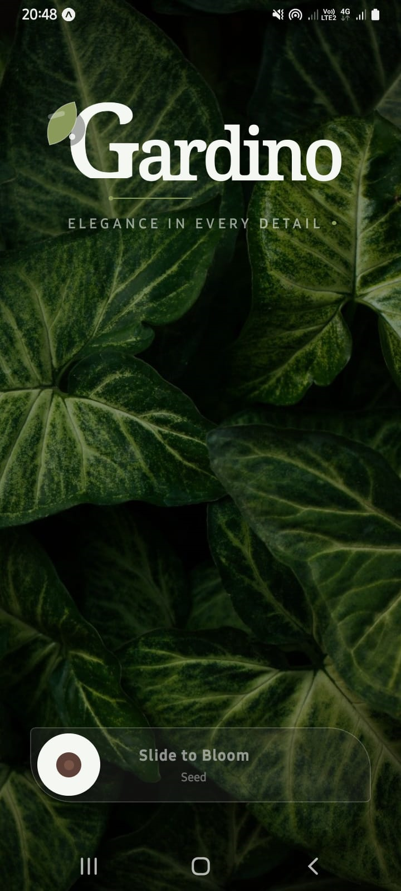
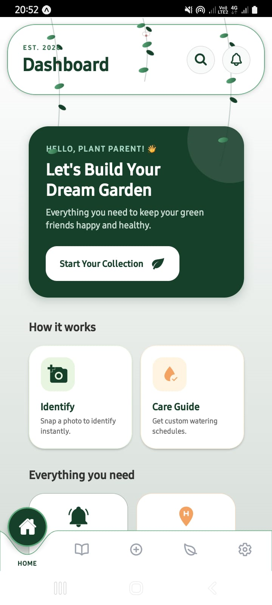
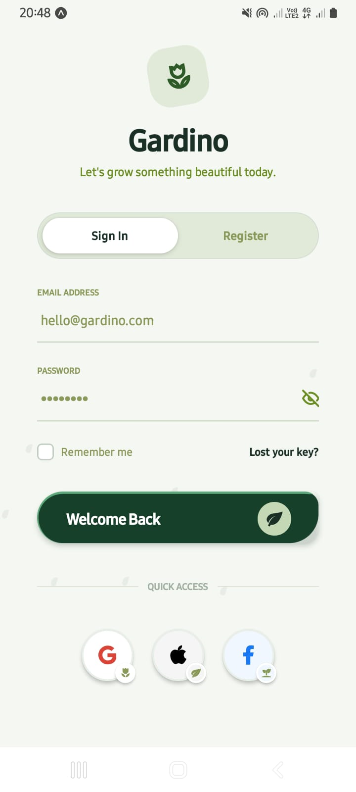
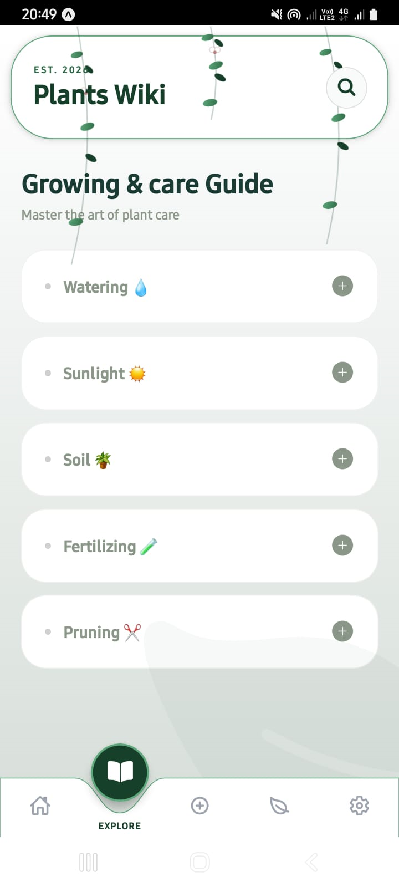
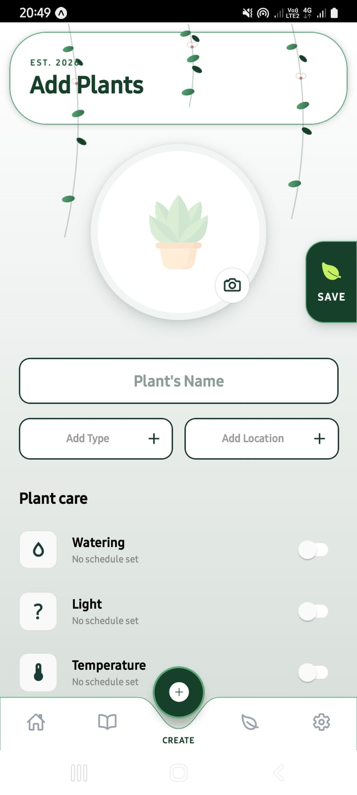
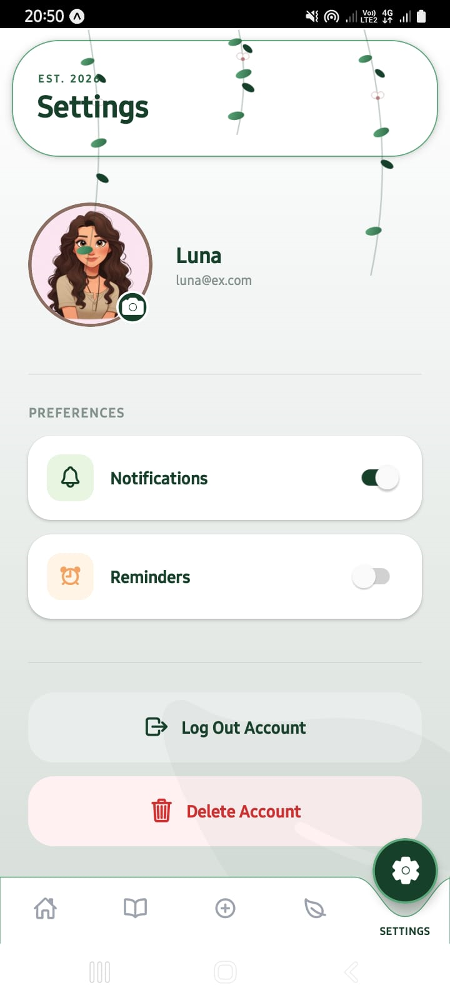

# 🌿 Gardino Plants Care App 

Plants Care App is a **mobile application built using React Native with Expo** that helps users manage and take care of their plants efficiently.  
The app provides a **clean and user-friendly interface** to track watering schedules, view plant details, receive reminders, and manage a plant collection.

This project is developed as a practical learning project focusing on **mobile app development, UI design, and state management**.

## 📌 Project Overview

Taking care of plants requires consistency and tracking. The **Plants Care App** solves this by:

- Managing multiple plants
- Tracking watering history
- Sending reminders for care tasks
- Providing detailed plant information

The app uses a **nature-inspired, minimal UI** to enhance user experience.

## ✨ Features

- 🌱 **Plant Management**
  - Add, edit, and delete plants
  - View plant details

- 💧 **Watering Tracking**
  - Mark plants as “Watered Today”
  - Keep a history of watering
  - Update last watered date automatically

- ⏰ **Reminders & Notifications**
  - Set and manage watering reminders
  - Receive push notifications for due tasks

- 👤 **User Profile**
  - View and edit profile information
  - Profile picture with frame and edit button
  - Logout functionality

- 🎨 **Modern UI**
  - Gradient backgrounds
  - Animated components and transitions
  - Clean bottom tab navigation
  - Responsive layouts for all devices

- 🔐 **Authentication**
  - Firebase login and registration
  - Secure user data management

## 🛠️ Technologies Used

- **React Native (Expo)**
- **TypeScript**
- **Firebase**
  - Authentication
  - Firestore Database
- **Cloudinary**
  - Image storage
  - Image optimization & CDN delivery
- **Expo Router** (Navigation)
- **Context API** (State Management)
- **Expo Linear Gradient**
- **Expo Vector Icons**
- **React Native Reanimated**
- **NativeWind / Tailwind-style utilities**

## ☁️ Cloudinary Integration

Cloudinary is used to handle **image uploads and storage** for plants and user profiles.

### Why Cloudinary?
- Secure cloud image storage
- Automatic image optimization
- Fast delivery using CDN
- Reduced app bundle size

### Image Upload Flow
1. User selects an image (camera or gallery)
2. Image is uploaded to Cloudinary
3. Cloudinary returns a secure image URL
4. Image URL is saved in Firebase Firestore
5. App displays image using the Cloudinary URL

## 📁 Folder Structure

     gardino-plants-care-app/
        expo/                       # Expo cache files
        github/                     # GitHub workflows & configs
        vscode/                     # VS Code settings
  
     app/                         # Expo Router screens
        (auth)/                    # Authentication flow
           _layout.tsx
           index.tsx
           loginRegister.tsx

      (dashboard)/               # Main dashboard (tabs)
         _layout.tsx
         home.tsx
         add.tsx
         log.tsx
         settings.tsx
         wiki.tsx

      (modals)/                  # Modal screens
         _layout.tsx
         edit-plant.tsx
         plant-details.tsx

      _layout.tsx                # Root layout

     assets/                      # Images, icons, fonts
  
     components/                  # Reusable UI components
        CareModal.tsx
        Header.tsx
        PlantCard.tsx
        RippleEffect.tsx
        Toast.tsx
  
     config/                      # App configurations
        firebase.ts                # Firebase configuration
  
     constants/                   # Static values & themes
  
     context/                     # Context API (Global State)
        AuthContext.tsx
        PlantContext.tsx
        SearchContext.tsx
  
     hooks/                       # Custom React hooks
  
     scripts/                     # Utility scripts
        reset-project.js
  
     services/                    # Business logic & APIs
        authService.ts
  
     node_modules/                # Dependencies
  
     .gitignore
     README.md                    # Project documentation
     app.json                     # Expo configuration
     babel.config.js
     eslint.config.js
     global.css                   # Global styles
     metro.config.js
     nativewind-env.d.ts
     package.json
     package-lock.json
     tailwind.config.js
     tsconfig.json

## 🚀 Installation

### 1. Clone the Repository
      git clone https://github.com/yashodha-gunawardana/plants-care-app-AMD.git
      cd plants-care-app-AMD

### 2. Install Dependencies
      npm install

### 3. Install Expo CLI (if not installed)
      npm install -g expo-cli

   Check installation:  expo --version

### 4. Configure Firebase
  - Create a Firebase project (https://firebase.google.com)
  - Enable Authentication (Email & Password)
  - Create a Firestore database
  - Add your Firebase config to config/firebase.ts

        export const firebaseConfig = {
           apiKey: "YOUR_API_KEY",
           authDomain: "YOUR_AUTH_DOMAIN",
           projectId: "YOUR_PROJECT_ID",
           storageBucket: "YOUR_STORAGE_BUCKET",
           messagingSenderId: "YOUR_MESSAGING_ID",
           appId: "YOUR_APP_ID",
        };

### 5. Start the App
      expo start
  - Opens Expo Developer Tools in your browser

### 6. Open the App
   - Physical Device: Use Expo Go and scan the QR code
   - Emulator/Simulator: Run on Android Studio or Xcode simulator

✨ The app should now be running locally!

## 📱 Screenshots 

### Welcome Screen

### Home Screen

### Home Screen

### Login Screen

### Register Screen

### Wiki Screen

### Add Screen

### History Screen

### Settings Screen
